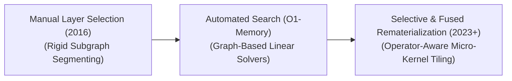

# Awesome-Activation-Checkpointing
## Activation Checkpointing: Evolution, Variants, Types, & Applications

Activation Checkpointing—also known as Gradient Checkpointing or Rematerialization—is a crucial hardware-aware memory optimization framework for training deep neural networks. In standard backpropagation, a GPU must store all layer activations generated during the forward pass in its fast Video RAM (VRAM) so they can be referenced later to compute gradients during the backward pass. This creates an $O(N)$ memory bottleneck that scales linearly with network depth and context length, frequently triggering Out-Of-Memory (OOM) errors. Activation Checkpointing breaks this bottleneck by discarding most intermediate activations after they are calculated and dynamically recomputing (rematerializing) them on-the-fly during the backward pass, trading extra compute cycles for massive VRAM savings.

---

## 1. The Chronological Evolution

The technical implementation of activation optimization has transitioned from static, hand-configured layer boundaries to automated compiler scheduling and cross-device heterogeneous hardware offloading.

*   **The Heuristic Manual Selection Era (Chen et al., 2016)**
    *   *Concept:* Formally introduced as "Training Deep Nets with Sublinear Memory." Developers had to manually divide a network into uniform segments or subgraphs. Only the boundary nodes (checkpoints) were kept in memory, while all inner-segment activations were discarded and recomputed.
    *   *Limitation:* Rigid and non-optimal for non-sequential, multi-branch transformer graph topologies.
*   **The Automated Graph Solver Era (~2019–2022)**
    *   *Concept:* Integrated into mainstream frameworks via tools like PyTorch's `checkpoint_wrapper` and compilers like **O1-Memory**. Instead of manual profiling, the framework analyzes the network's Computational Directed Acyclic Graph (DAG), modeling activation storage as an optimization problem to find the exact mathematical balance between memory caps and compute overhead.
*   **The Selective & Fused Rematerialization Era (~2023–Present)**
    *   *Concept:* Modern frontier state-of-the-art framework popularized by **Megatron-LM**, **FlashAttention**, and **Liger Kernel**. Instead of discarding entire layers wholesale, it identifies and targets *only* the specific operators that consume immense memory but are extremely cheap to recompute (such as Attention Softmax, LayerNorm, and Dropout), keeping high-cost matrix multiplications safely cached.

---

## 2. Core Functional & Functional Variants

Activation checkpointing configurations vary based on the granularity of the structural cuts and how the recomputation scheduling is bound across the network nodes.

*   **Full (Grandchild) Checkpointing**
    *   *Mechanism:* Clears all non-checkpoint activations across an entire Transformer block (Attention + MLP). During the backward pass, the entire forward pass for that block is re-executed from scratch.
    *   *Pros:* Maximizes VRAM reduction, dropping activation memory footprints by up to 70–80%.
    *   *Cons:* Introduces a flat $\sim 33\%$ computational time penalty over traditional full fine-tuning loops.
*   **Selective Checkpointing**
    *   *Mechanism:* Retains the activations of heavy, high-compute layers (like $O(N^2)$ Matrix Multiplications) but aggressively drops and rematerializes highly redundant, memory-heavy activation tensors (like element-wise non-linear activations or dropout masks).
    *   *Pros:* Reclaims up to 50% of peak memory overhead while dropping the computational time penalty down to a negligible 2–5%.
*   **Offloaded Checkpointing (CPU Offloading)**
    *   *Mechanism:* Rather than discarding activations or keeping them in precious VRAM, it streams the checkpoint tensors out to slow host CPU RAM over the PCIe bus during the forward pass, pulling them back asynchronously exactly when the backward pass demands them.

---

## 3. Structural Storage & System Implementation Types

Depending on the engine abstraction layer, activation checkpointing protocols interface differently with low-level CUDA infrastructure.

*   **PyTorch Native `torch.utils.checkpoint`**
    *   *Implementation:* The standard entry-level framework. It intercepts the autograd engine during the forward pass, substituting standard tracking with dummy forward functions that record input arguments but skip activation tensor allocation.
*   **Megatron-LM Selective Activation Checkpointing**
    *   *Implementation:* NVIDIA's highly optimized pipeline built specifically for massive distributed pipeline and tensor-parallel processing across GPU clusters. It shards the checkpoint allocations across parallel nodes natively.
*   **Unsloth / Triton Fused Kernel Rematerialization**
    *   *Implementation:* Rewrites terminal layers (like Cross-Entropy Loss and SwiGLU activations) into highly optimized, handwritten OpenAI Triton kernels.
    *   *Pros:* Bypasses standard PyTorch autograd tracking entirely, fusing the activation calculation and backpropagation step directly inside fast GPU SRAM registers to eliminate memory footprint inflation altogether.

---

## 4. Production Scaling Laws & Hardware Trade-Offs

While Activation Checkpointing acts as a lifeline for scaling up batch sizes, it changes the hardware resource balancing profile.

*   **The Activation Memory Bottleneck**
    *   *The Phenomenon:* As context windows scale (e.g., from 8k to 128k tokens), activation memory grows quadratically, quickly surpassing the memory required to host the model weights themselves.
    *   *The Optimization Equation:* Full checkpointing bounds the memory footprint curve down to an approximate square-root progression ($\sqrt{\text{Layers}}$), allowing context lengths to scale smoothly.
*   **The 33% Compute Penalty Math**
    *   *The Phenomenon:* In standard training, a model executes 1 Forward Pass and 1 Backward Pass ($1\text{F} + 1\text{B}$). Full checkpointing forces an extra forward pass inside the loop ($1\text{F} + 1\text{F}_{recompute} + 1\text{B}$), mathematically translating to a $\sim33\%$ computational time overhead.
    *   *Mitigation:* Pairing activation checkpointing with **FlashAttention** and **Fused Optimizers** to accelerate the execution speed of the recomputation step.

---

## 5. Frontier Distributed Applications

*   **Pre-Training Million-Context Foundation Models**
    *   *Application:* Serves as the bedrock infrastructure layer enabling modern long-context models. Without activation checkpointing, computing self-attention over a 1M token string would cause cluster-wide memory crashes on step zero.
*   **Full Fine-Tuning of Ultra-Large Parameter LLMs**
    *   *Application:* Permits research institutions to run full fine-tuning routines on massive 70B+ parameter models across standard enterprise server nodes without being forced to quantize or compromise base parameters.
*   **High-Resolution 3D Spatio-Temporal Video Generative Training**
    *   *Application:* Video generative networks (like Sora or LTX-Video) train over massive video sequence grids. Storing every intermediate pixel activation map generated across deep 3D transformer layers would quickly saturate high-bandwidth GPU memory, requiring selective activation rematerialization to maintain training feasibility.

