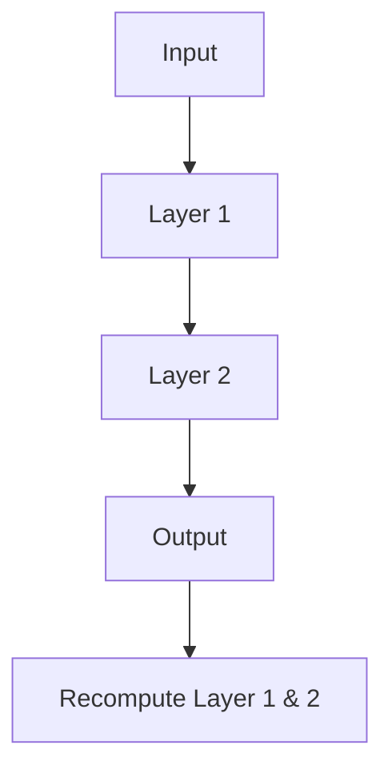

# Full (Grandchild) Checkpointing

Details of full checkpointing.

```mermaid
graph TD
    A[Input] --> B[Layer 1]
    B --> C[Layer 2]
    C --> D[Output]
    D --> E[Recompute Layer 1 & 2]
```

[Back to README](../README.md)
