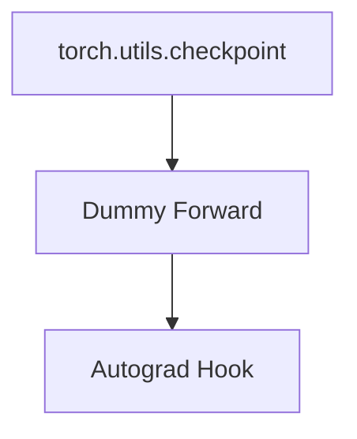

# PyTorch Native `torch.utils.checkpoint`

Details of PyTorch implementation.

```mermaid
graph TD
    A[torch.utils.checkpoint] --> B[Dummy Forward]
    B --> C[Autograd Hook]
```

[Back to README](../README.md)
