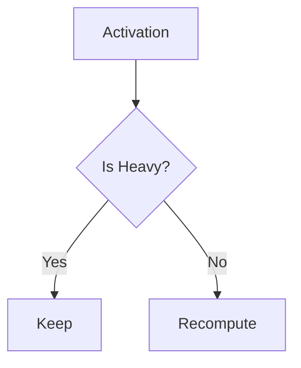

# Selective Checkpointing

Details of selective checkpointing.

```mermaid
graph TD
    A[Activation] --> B{Is Heavy?}
    B -- Yes --> C[Keep]
    B -- No --> D[Recompute]
```

[Back to README](../README.md)
